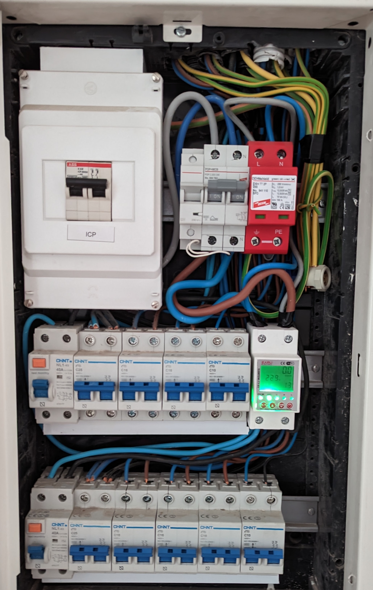
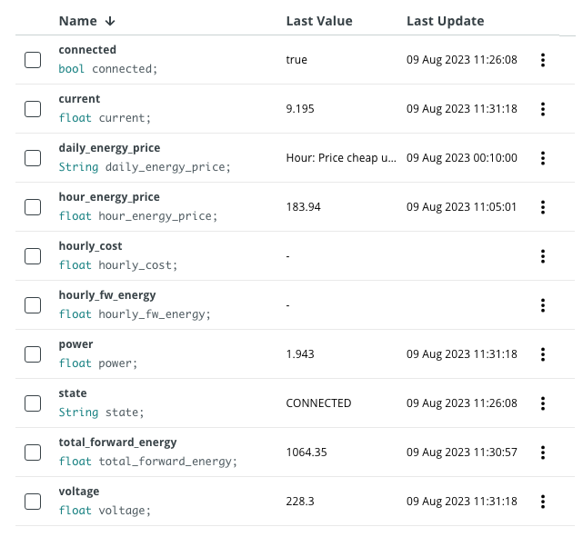
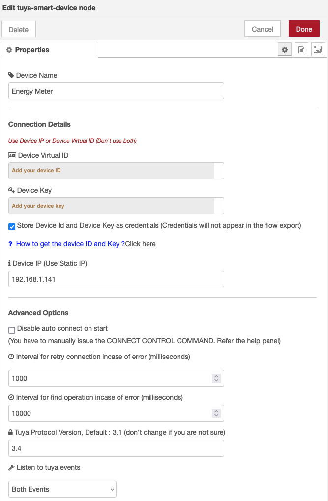
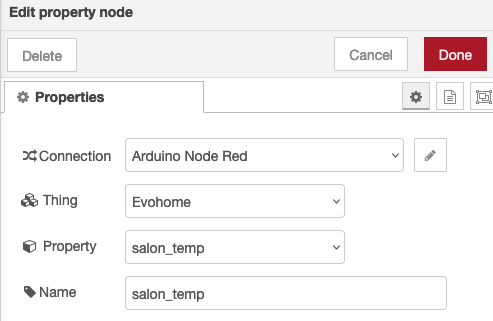
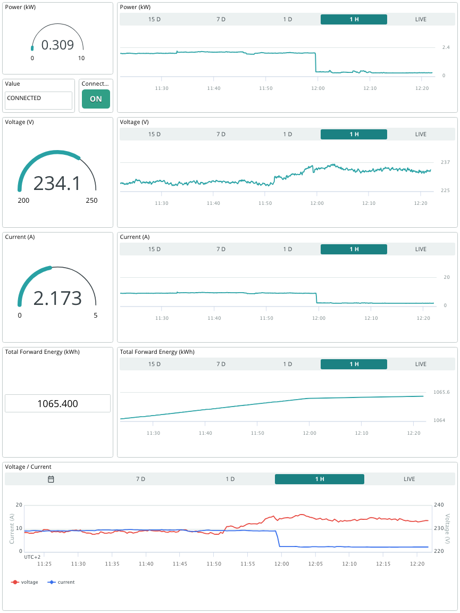

arduino-cloud-tuya-energy-nodered
=================================

This project shows how to monitor the energy consumption of your home using a Tuya compatible energy meter and Arduino Cloud.

# Introduction
We're surrounded by systems in our homes that help us control and manage our environment. From controlling the heating system and monitoring the temperature to managing the lights and more, these systems make our lives easier. 

While we can control most of these systems through PC or mobile apps, they are usually locked-in and it can get sometimes not practical to have multiple applications. That's where an integrated platform comes in, offering a centralized hub for all our customized dashboards.

But additionally, sometimes, we want to combine data from different applications to trigger actions on other systems. And if you're an Arduino enthusiast like me, you'd want to integrate all of it with your Arduino projects. 

Arduino Cloud is an excellent solution for that, but integrating external platforms can be a bit tricky, especially with many commercial products lacking direct integration. That's where Node-RED comes to the rescue! It helps us redirect and manage the traffic between these commercial products and Arduino Cloud. 

This project is part of a series that I've created to showcase how I manage my home systems by integrating them with Arduino Cloud. In addition to this project, I've also worked on integrating [TP Link smart plugs](https://github.com/dbduino-prjs/arduino-cloud-tplink-plug-nodered) and [Honeywell Evohome heating system](https://github.com/dbduino-prjs/arduino-cloud-evohome-nodered), so you can check those out too! 

## What is Tuya / Smartlife?
[Tuya](https://www.tuya.com/) and [Smart Life](https://ismartlife.me/) are platforms and ecosystems for smart home devices and Internet of Things (IoT) products. Tuya provides a cloud-based platform that enables manufacturers to quickly and easily add smart features to their products, such as smart plugs, smart bulbs, smart thermostats, and more. Smart Life is one of the user-facing mobile apps developed by Tuya, allowing users to control and manage their Tuya-compatible smart devices from a single app on their smartphones or tablets.

Tuya and Smart Life have become popular choices for both manufacturers looking to create smart products and consumers seeking a unified way to manage their various smart devices from different brands. The platforms aim to streamline the development and usage of smart home and IoT devices through cloud connectivity and a user-friendly interface.

## What is Arduino Cloud?
[Arduino Cloud](https://cloud.arduino.cc) is a platform that simplifies the process of developing, deploying, and managing IoT devices. It supports various hardware, including Arduino boards, ESP32, and ESP8266 based boards, and makes it easy for makers, IoT enthusiasts, and professionals to build connected projects without coding expertise. 

The platform's IoT Cloud tool allows for easy management and monitoring of connected devices through customizable dashboards, which provide real-time visualisations of the device's data. The dashboards can be accessed remotely through the mobile app Arduino IoT Cloud Remote, which is available for both Android and iOS devices, allowing users to manage their devices from anywhere.

## What is Node-RED?
[Node-RED](https://nodered.org/) is an open-source visual programming tool designed for connecting and automating devices, services, and APIs. It provides a browser-based flow editor that allows users to create flows by dragging and dropping nodes onto a canvas and connecting them together. Each node represents a specific functionality or service, such as data input/output, data transformation, or communication with external systems. With its intuitive interface and extensive library of pre-built nodes, Node-RED enables users to quickly and easily create complex workflows without the need for traditional coding. It is particularly popular in the Internet of Things (IoT) domain, where it simplifies the integration of various sensors, devices, and cloud services, allowing users to build powerful IoT applications and automation systems.

# Pre-requisites
You need:
* a Tuya / Smartlife compatible energy meter
* SmartLife or Tuya app installed in your mobile phone (iOS / Android)
* The Energy Meter added to the Tuya Smart app
* an Arduino Cloud account (https://cloud.arduino.cc)
* an instance of Node-RED (running on a local or Cloud machine). You can find more information about how to install Node-RED [here](https://nodered.org/docs/getting-started/local).

You don't need:
* any Arduino, ESP32 or ESP8266 devices

# The process 
1. Install the energy meter in the electric board
2. Get your Tuya device API key 
3. Create the Device and Thing in the Arduino Cloud
4. Create the Node RED flow 
5. Create the Arduino Cloud Dashboard 
6. Test everything 

## Install the energy meter in the electric board
For this project, I used an [Earu Electric Leakage breaker](https://es.aliexpress.com/item/1005005474961812.html?spm=a2g0o.productlist.main.1.64b72e8fBv8qNz&algo_pvid=0190745a-8ab6-4d1b-ae9a-2fc064272739&aem_p4p_detail=202308070751462216909798018100004414180&algo_exp_id=0190745a-8ab6-4d1b-ae9a-2fc064272739-0&pdp_npi=4%40dis%21EUR%2125.22%2113.62%21%21%2127.10%21%21%4021038eda16914199060958571e5420%2112000033229985254%21sea%21ES%21138088978%21&curPageLogUid=4T9VEiT2qT2n&search_p4p_id=202308070751462216909798018100004414180_1). Although it works well, it is true that it needs to be placed in a location with a very stable WIFI.
All this kind of devices are very easy to install and you can just follow the instructions in the manual.
This is a picture of my final setup:

## Get your Tuya device API key
The process is very straightforward. You just have to create a Tuya developer account, create an application and get the API key.

> Note: Bear in mind that the Tuya account (the one used on your mobile app and the developer account are different, even if you use the same address. They will be linked during the process)

1. Sign up for an IoT account (if you don't have an account yet)
Go to https://iot.tuya.com and click Sign Up
2. Sign in and go to the [Cloud projects](https://iot.tuya.com/cloud) section
3. Click on **Create Cloud project**.
Select the Free plan or Trial edition if asked.
Click *Authorize* for the recommended APIs
4. Link devices registered in your Tuya app to the IoT site
From your project, go to the **Devices** tab, then **Link Tuya App Account**, then **Add App Account**
Follow the instructions (you will be asked to scan the QR code with Smart Life App to authorize)
5. Get your Device ID
Go back to the **All Devices** tab and note down your **Device ID**
6. Get you Device API key
Go to Cloud->API Explorer.
Click on **Query Device Details in Bulk**. Introduce the **Device ID** and click on **Submit Request**
In the response, you will find a field **local_key**. Note down the value.

> Note: You can get more detailed information [here](https://github.com/iRayanKhan/homebridge-tuya/wiki/Get-Local-Keys-for-your-devices)

## Create the Device in the Arduino Cloud
### Create the Device 
Go to the [Devices](https://create.arduino.cc/iot/devices) section of the Arduino IoT Cloud and click on **ADD**. 
Select **Any Device** and follow the instructions on the wizard.

> Note: Save your `Device ID` and `Secret Key`. We are not going to use them (as we will use the API key), but it can be helpful for other use cases.

### Create the Thing 
In the Devices list, find the device you just created and click on **CREATE THING** and assign a name to it.

### Create the Variables 
Add the variables clicking on the ADD button. At the end of the process, your list of variables should look like this.

| Name                | Type       | Description |
|---------------------|------------|-------------|
| state               | CHARSTRING | Text string with the state |
| connected           | STATUS     | It indicates if the Energy Meter is | power               | FLOAT      | Real-time power |
| voltage             | FLOAT      | Real-time voltage |
| current             | FLOAT      | Real-time current |
| total_forward_energy| FLOAT      | Accumulated energy |

> Note: All the variables have to be READ-WRITE. You can define the periodicity you wish or set them with the policy ON-CHANGE.*

This is a screenshot for reference.

### Get an Arduino Cloud API key
- Go to https://cloud.arduino.cc/home/api-keys.
- Click on **CREATE API KEY**, enter a name.

Note down the Client ID and Client Secret or download the PDF. We will use these credentials in the Node-RED node.

## Create the Node-RED flow
Access your Node-RED instance (typically `http://<YOUR_IP>:1880`) and import the code:
1. Select `Import` in the menu
   - Paste the code that you can find in [flows.json](https://github.com/dbduino-prjs/arduino-cloud-tuya-energy-nodered/blob/master/flow.json?raw=true) in the github project
   - Click on `Import`
2. Configure the Tuya nodes using the Device ID and Key that you obtained earlier

> Note: You can adjust your configuration to your needs. For instance, you could leave Device IP empty so that you use the platform directly*

3. Configure the Arduino Cloud nodes
   - Configure your connection with the Arduino Cloud API key that you created in the previous section  
   - Introduce your Thing and property

4. Click on **Deploy** (top right corner of the screen)

## Create the Arduino Cloud dashboard
Go to the Dashboards section and click on **CREATE**. 
You can add the widgets as you wish. Here you have a screenshot of mine as a reference:

## Let's test the system
And that's it.
Now it is time to go to your Arduino Cloud dashboard and see the evolution of the temperature and perform the desired actions.

### About

This is your project's README.md file. It helps users understand what your
project does, how to use it and anything else they may need to know.